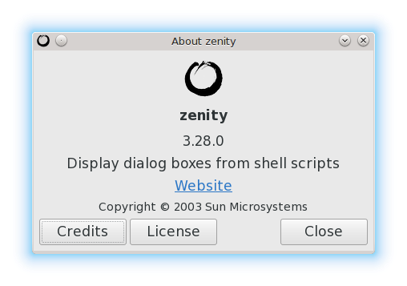

# Zenity Test

## About
Zenity is a small utility that enables display of some Gtk GUI dialogs from CLI scripts.

## Bash
`hello-world` Basic, starter script, to display "Hello World!" message using zenity Info dialog box.

## Python
`hello-world.py` Basic, starter script, to display "Hello World!" message using zenity Info dialog box.

## Resources
GNOME: [Zenity Manual](https://help.gnome.org/users/zenity/stable/ "Zenity Manual - GNOME Help")

GitLab: [GNOME/zenity](https://gitlab.gnome.org/GNOME/zenity "GNOME / zenity - GitLab") 
Wikipedia: [Zenity](https://en.wikipedia.org/wiki/Zenity "Zenity - Wikipedia")

Slackware 14.2: [Zenity (3.28.0)](https://slackbuilds.org/repository/14.2/desktop/zenity/ "Zenity - SBo")

## License
This project is licensed under [MIT License](LICENSE "Read the LICENSE file").

[Know your rights](https://choosealicense.com/licenses/mit/ "Read about MIT License permissions").

&copy; 2022 Nenad Trajkovic
